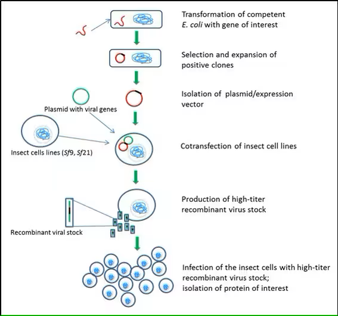
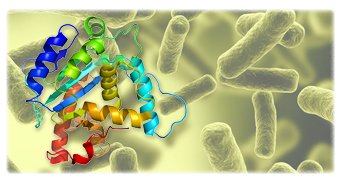

# Optimizing Protein Titer Production Process using Interpretable Machine Learning Models

## Principal Investigator: Dr. Talayeh Razzaghi (Professor of Industrial and Systems Engineering - University of Oklahoma)

### Project Overview
This project aims to enhance protein titer production efficiency in biopharmaceutical manufacturing by leveraging advanced machine learning (ML) and data analytics. We focus on analyzing Cytovance datasets to identify key factors influencing protein titer yields and develop predictive models for both production optimization and anomaly detection in biotech manufacturing processes.

    

### Goals
- **Optimize Protein Titer Production:** Utilize ML models to predict and enhance protein titer yields, focusing on significant production variables.
- **Anomaly Detection:** Develop models to identify and predict anomalies in manufacturing processes, reducing costs and improving quality control.

### Data Insights
Our analysis includes a comprehensive review of input variables affecting protein titer levels, identified through a preliminary study with Cytovance. The response variable, titer by Octet (mg/L), alongside various output variables, provides a robust dataset for model training and validation.

    

### Methodology
- **Data Analysis:** Perform detailed statistical analysis to identify key factors influencing protein production.
- **Model Development:** Build interpretable ML models for predicting protein titer levels and detecting manufacturing anomalies.

### How to Use This Repository
- **Data:** [...in view ]
- **Code:** [...in view ]
- **Results:** [...in view ]

### Acknowledgments
This project is made possible through collaboration with Cytovance and the valuable insights from their datasets. We extend our gratitude to all contributors and supporters of this research endeavor.